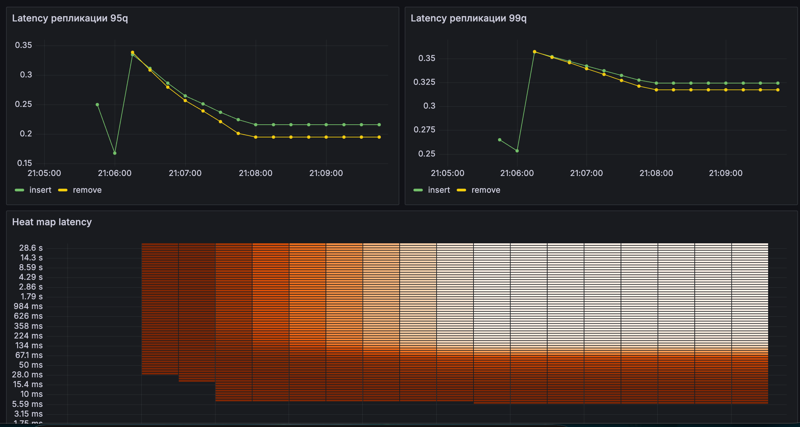
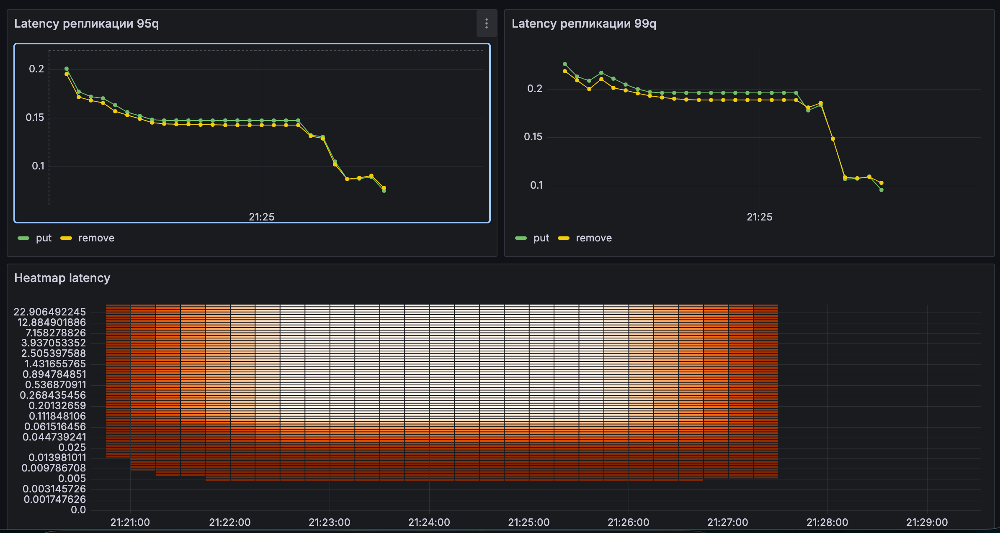
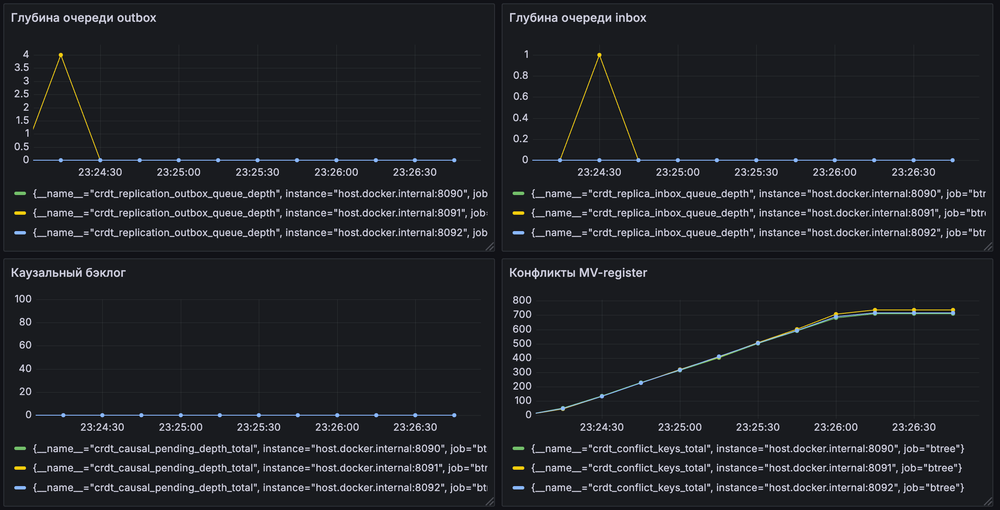
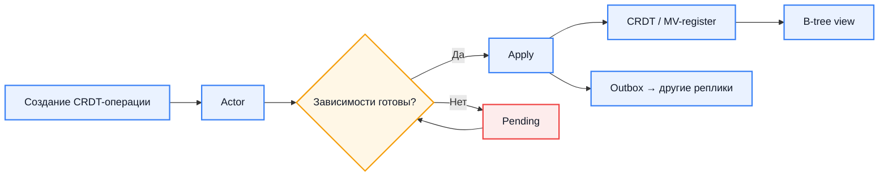

# Распределенное B-tree

## Описание

Данный проект представляет собой реализацию распределенного поискового индекса на основе B-tree.
Дерево обладает следующими свойствами:
- Ключи имеют отношение нестрогого порядка;
- Дерево реплицировано;
- Репликация поддерживается следующими стратегиями: с мастером и CRDT.

## Реализация CRDT-репликации

### Первая версия: CvRDT

В качестве первой версии были использованы CRDT на основе состояний (Convergent Replicated Data Types). Для этого
в B-Дерево была добавлена информация об идентификаторе узла и времени последнего применения операции, а также два
Grow-Only множества, обозначающие счетчики добавленных и удаленных ключей. Благодаря этому в дереве не происходило
физическое удаление ключей и при добавлении удаленного ключа не нужно было перестраивать дерево (только помечать
tombstone удаленный ключ), а также использование таких множеств гарантировало коммутативность.

Основным недостатком является передача полного состояния дерева. В тестировании это проблем не вызывало, т.к. был
малый объем дерева, но для бизнеса это бы стало проблемой. Также, по результатам 
[бенчмарков](./benchmark-results/first-v-benchmark.txt) видно, что CRDT выигрывает по времени только по операции
проверки существования ключа из-за модифицированного хранения состояний ключа (проверка идет через словарь, а не
через обход всего дерева как в традиционном варианте).

После консультаций было принято решение поддержать вторую версию CRDT.

### Вторая версия: CmRDT

Во второй версии используются CRDT на основе операций (Commutative Replicated Data Types). В отличие от предыдущей
версии сама структура B-Дерева внутри никак не изменяется, реплицируются только сами операции изменения состояния.
Для каждого ключа хранится Multi-Value регистр. Это нужно для того, чтобы в случае конфликта не терять значения
ключа, а хранить их все. Также для корректной работы дерева необходимо соблюдать каузальный порядок, который 
достигается за счет буфферинга операций и локальное применение только при соблюдении нужных условий.

По предварительным нагрузочным тестированиям были получены следующие результаты.

Мастер-репликация:


CRDT-репликация:


Видно, что задержка у CRDT меньше примерно на 100 мс по 99q.

Также графики, что на CRDT попадают конфликтные ключи и работает регистр:


## Планы

- [x] Реализовать прототип дерева с поддержкой отношения нестрогого порядка;
- [x] Реализовать базовый алгоритм репликации с мастером;
- [ ] Реализовать алгоритм репликацией с кворумом (Raft);
- [x] Реализовать алгоритм репликации с CRDT (расширить);
- [x] Бенчмарки по скорости (расширить);
- [ ] Оптимизация (использование FastUtil, garbage collector для удаленных ключей). 

## Скрипты нагрузочного тестирования

#### Мастер-репликация

Проверка:
```bash
curl -X POST http://localhost:8080/api/tree/insert \
  -H "Content-Type: application/json" \
  -d '{"key":"42","value":"hello"}'

curl http://localhost:8081/api/tree/42
curl http://localhost:8082/api/tree/42
```

```shell
curl http://localhost:8081/api/tree/42
curl http://localhost:8082/api/tree/42
```

```shell
cd load-test
python3 -m venv .venv
source .venv/bin/activate
pip install -r requirements.txt
locust -f locustfile-master.py --headless -u 200 -r 20 --run-time 2m
```

#### CRDT-репликация

Проверка:
```bash
curl -X POST http://localhost:8080/api/crdt/tree/insert \
  -H "Content-Type: application/json" \
  -d '{"key":"42","value":"hello"}'

curl http://localhost:8081/api/crdt/tree/42
curl http://localhost:8082/api/crdt/tree/42
```

```shell
curl http://localhost:8081/api/crdt/tree/42
curl http://localhost:8082/api/crdt/tree/42
```

```shell
cd load-test
python3 -m venv .venv
source .venv/bin/activate
pip install -r requirements.txt
locust -f locustfile-crdt.py --headless -u 200 -r 20 --run-time 2m
```

Тестирование с конфликтами
```shell
cd load-test
python3 -m venv .venv
source .venv/bin/activate
pip install -r requirements.txt
locust -f locustfile-crdt-conflict.py --headless -u 80 -r 15 --run-time 2m
```

